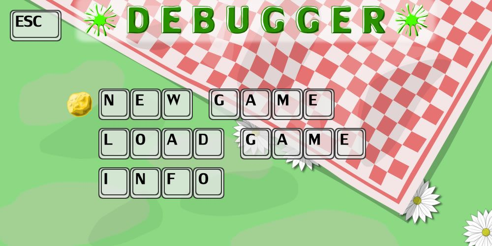
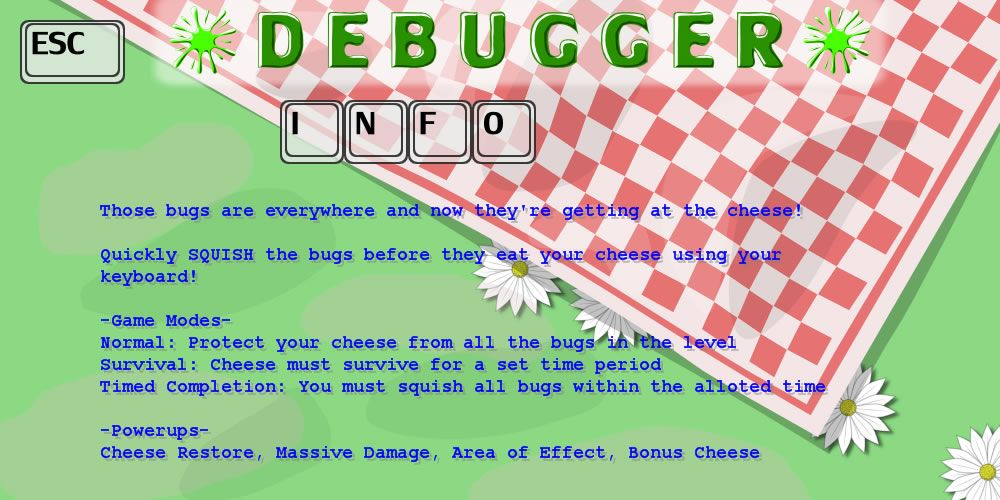
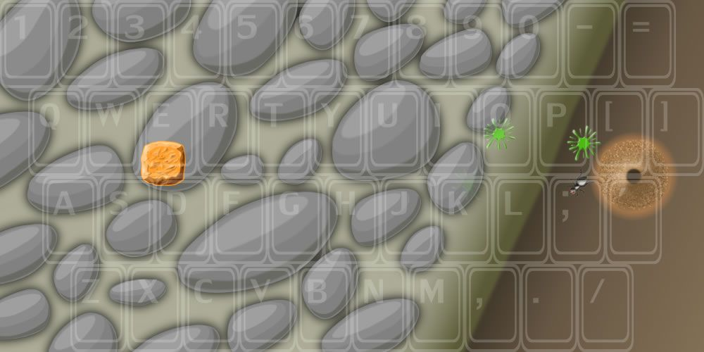
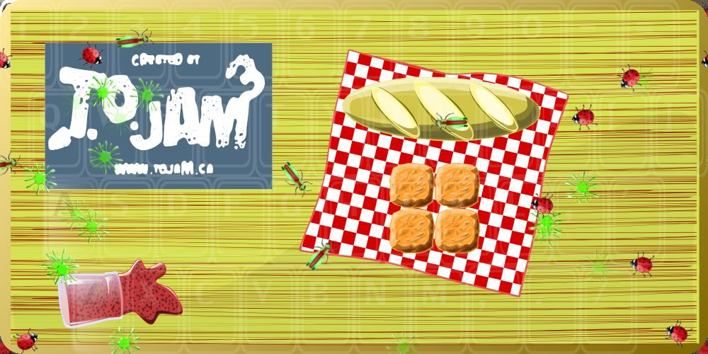
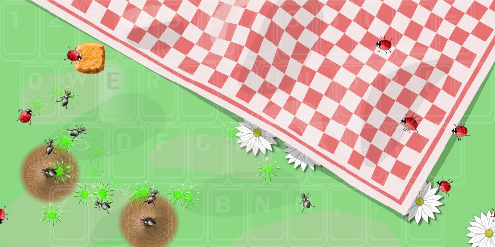
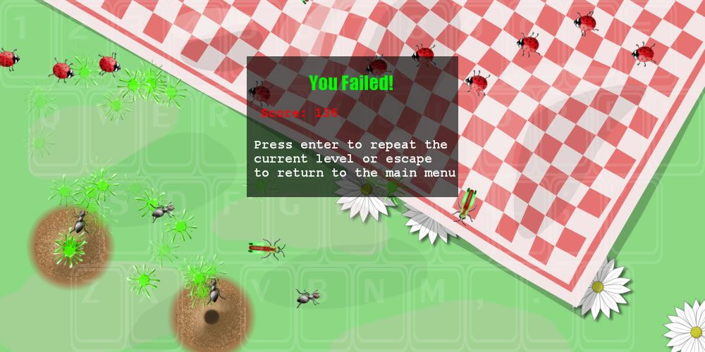

# Debugger

Debugger was originally featured as the People's Choice Silver game at the Toronto Game Jam 2008 (Theme Cheese)

[MobyGames Page](https://www.mobygames.com/game/34787/debugger/)

Debugger was developed for the 2008 Toronto Game Jam and won second place. As the competition's theme was cheese in this game players have to defend different portions of cheese from bugs by squishing them. The game is played against different backdrops with a semi-transparent keyboard overlay that shows the symbols.

As soon as the bugs appear, players need to furiously tap the keyboard at the correct keys to squish the bugs. If they get too close the bugs will start eating the cheese. Levels come with different challenges such as normal (protect the cheese against the bugs to win the level), survival (protect the cheese for a set amount of time) and timed completion (squish all bugs before time runs out). Players can also earn power-ups such as cheese restore, massive damage, area of effect and bonus cheese. The game keeps track of the score.

## Screenshots:

## Credits

Programmers 	

    Jason Bourne, Chris Brown, Mike Darmitz, Will Hua, FanFan Huang

Level Designers 	

    Jason Bourne, Chris Brown, Mike Darmitz, Will Hua, FanFan Huang

Artists 	

    Mike Darmitz, Will Hua, FanFan Huang

Audio Engineer 	

    Mike Darmitz

AI Designers 	

    Will Hua, FanFan Huang

## Build requirements

Built with Microsoft Visual Studio 2005 in C# and XNA 2.0

